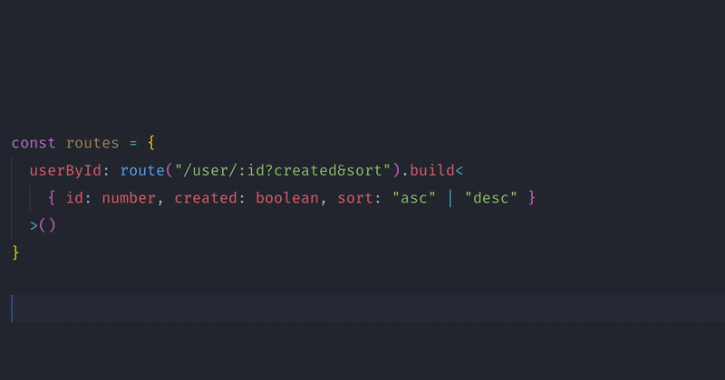

# [](#motivation)

Ruty is a simple URL route builder, that [support typing route params and queries string with TypeScript](#typescript).

#### Motivation

_Whether I am working in the frontend or backend, I always define a set of URLs wether for API endpoints or page URLs. Therefore, instead of having all these URLs routes spread out within multiple files, I prefer to have them defined in one file then reference them where I need them. Also, using TypeScript I prefere to have my URLs routes params and queries string typed. **That's the reason I created**_ **`ruty`** _**, a tiny library that allow me to define routes with their params and queries strings.**_

## Features

- TypeScript support.
- Typed route params `/:param` and typed query strings `?query&string`.
- No dependencies.
- 100% test coverage.

## Installation

```sh
npm i ruty
```

## Usage

```ts
import { Ruty } from 'ruty'

const { route } = Ruty.configure()

const routes = {
  home: route('/').build(),
  users: route('/users').build(),
  userById: route('/user/:id?created&sort').build(),
}

routes.home()
// '/'
routes.users()
// '/users'
routes.userById({ id: 123 })
// '/user/123'
routes.userById({ id: 123, created: true, sort: 'desc' })
// '/user/123?created&sort=desc'
```

## TypeScript

You can type your route params and queries string with TypeScript by adding generics to the `build` method as shown below:

```ts
import { route } from 'ruty'

Ruty.configure()

const routes = {
  userById: route('/user/:id?created&sort').build<{
    id: number
    created: boolean
    sort: 'asc' | 'desc'
  }>(),
}

routes.userById({ id: 123, created: true, sort: 'desc' })
// '/user/123?created&sort=desc'
```

Then you will have autocomplete suggestions and type assertion:



## Configuration

Any configuration is passed to `Ruty.configure(...)`.

```ts
const ruty = Ruty.configure({
  // 👇 Add a prefix to all genrated routes.
  prefix: '/:language',
  // 👇 A function that transform the value for route params. Not yet implemented.
  paramTransformer: (param, value) => value,
  // 👇 A function that transform the value for query strings. Not yet implemented.
  queryTransformer: (query, value) => value,
  // 👇 Global route params. Not yet implemented.
  params: {
    language: () => detectLanguage(),
  },
  // 👇 Global query string. Not yet implemented.
  query: {
    theme: 'dark',
  },
})
```

## Development

If you want to contribute to development please follow these instructions:

1.  Clone this repo.
2.  Install dependencies with `npm i`.
3.  Add your changes, make sure to include tests.

Tests can be run with `npm t`. If you want to run tests in watch mode use: `npm t -- --watch`. Also, if you want to run tests coverage use: `npm t -- --coverage`.

## Release

Releases are done with: `npm run release`.

---

<center>
<small>

Made with love by [@rmariuzzo](https://github.com/rmariuzzo) and [contributors](https://github.com/rmariuzzo/ruty/graphs/contributors).

</small>
</center>
